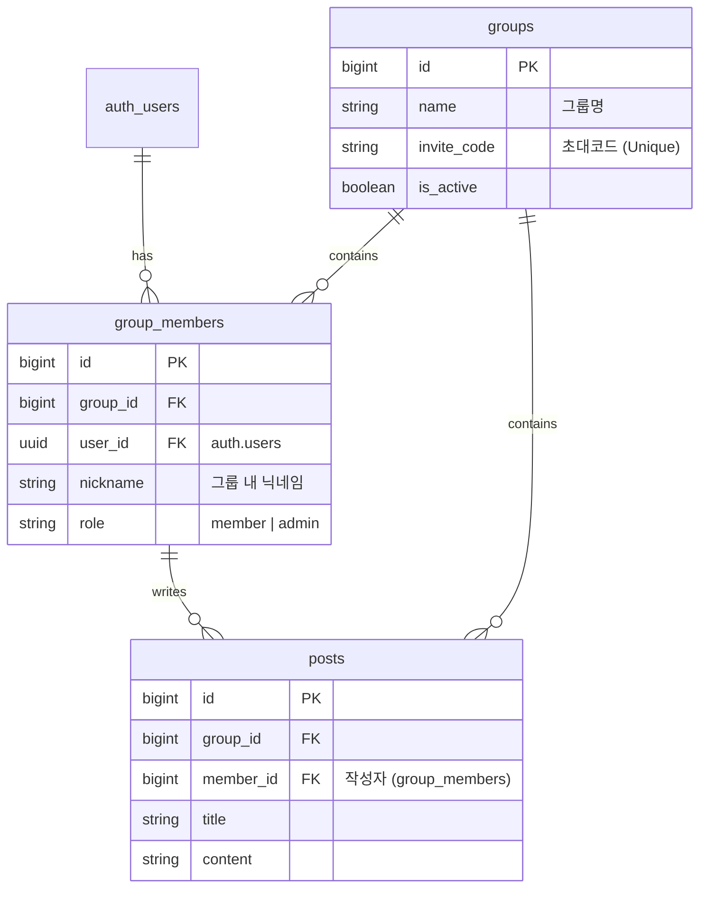

# V2 아키텍처: 그룹형 익명 커뮤니티 (Invite-Only Circles)

이 문서는 기존의 전역 익명 게시판을 **"초대 코드 기반의 폐쇄형 그룹 커뮤니티"**로 확장하기 위한 설계 문서입니다.

## 1. 시스템 개요

### 핵심 컨셉
- **익명성 유지**: 기존의 `signInAnonymously()`(기기 기반 UUID) 인증 방식을 유지하여 진입 장벽을 최소화합니다.
- **폐쇄형 그룹**: 관리자가 발급한 **초대 코드(Invite Code)**를 통해서만 특정 그룹에 입장할 수 있습니다.
- **멀티 페르소나**: 사용자는 그룹마다 서로 다른 **랜덤 닉네임**을 부여받아 활동합니다. (A그룹: '춤추는 판다', B그룹: '고독한 늑대')

### User Flow
1. **앱 실행**: Supabase 익명 로그인 (UUID 발급).
2. **그룹 입장**: 메인 화면에서 초대 코드 입력.
3. **멤버십 생성**: 코드가 유효하면 서버(DB Function)가 그룹 멤버로 등록하고 랜덤 닉네임을 부여.
4. **활동**: 해당 그룹 내에서 부여받은 닉네임으로 게시글/댓글 작성.

---

## 2. 데이터베이스 스키마 설계

기존 `posts`, `comments` 구조에 그룹 관리 기능을 추가합니다.

### ERD (Entity Relationship Diagram)



---

## 3. 마이그레이션 SQL (Supabase 적용)

Supabase SQL Editor에서 아래 코드를 순서대로 실행하여 V2 구조를 적용합니다.

### Step 1: 테이블 생성

```sql
-- 1. 그룹 테이블
create table public.groups (
  id bigint generated by default as identity primary key,
  created_at timestamp with time zone default timezone('utc'::text, now()) not null,
  name text not null,
  description text,
  invite_code text not null unique, -- 초대 코드 (관리자가 설정)
  is_active boolean default true
);

-- 2. 그룹 멤버 테이블 (User <-> Group 연결)
create table public.group_members (
  id bigint generated by default as identity primary key,
  joined_at timestamp with time zone default timezone('utc'::text, now()) not null,
  group_id bigint references public.groups(id) on delete cascade not null,
  user_id uuid references auth.users(id) not null,
  nickname text not null, -- 그룹 전용 닉네임
  role text default 'member',
  
  -- 한 유저는 한 그룹에 한 번만 가입 가능
  unique(group_id, user_id)
);

-- 3. 기존 Posts 테이블 수정 (그룹 종속성 추가)
-- 주의: 기존 데이터가 있다면 백업 필수
alter table public.posts add column group_id bigint references public.groups(id) on delete cascade;
alter table public.posts add column member_id bigint references public.group_members(id) on delete set null;

-- (선택) 기존 데이터 처리: null 허용 후 나중에 not null로 변경 권장
-- alter table public.posts alter column group_id set not null;
-- alter table public.posts alter column member_id set not null;
```

### Step 2: 그룹 가입 로직 (Postgres Function)

클라이언트에서 닉네임을 생성하지 않고, DB 내부에서 안전하게 처리합니다.

```sql
-- 랜덤 닉네임 생성 및 그룹 가입 함수
create or replace function join_group_via_invite(
  invite_code_input text
) returns json as $$
declare
  target_group_id bigint;
  new_member_id bigint;
  random_nickname text;
  adjectives text[] := array['고독한', '춤추는', '배고픈', '즐거운', '시크한', '용감한', '조용한'];
  nouns text[] := array['판다', '호랑이', '토끼', '부엉이', '여우', '늑대', '거북이'];
begin
  -- 1. 초대 코드로 그룹 찾기
  select id into target_group_id from public.groups 
  where invite_code = invite_code_input and is_active = true;

  if target_group_id is null then
    raise exception '유효하지 않은 초대 코드입니다.';
  end if;

  -- 2. 이미 가입했는지 확인
  if exists (select 1 from public.group_members where group_id = target_group_id and user_id = auth.uid()) then
    raise exception '이미 가입된 그룹입니다.';
  end if;

  -- 3. 랜덤 닉네임 생성 (예: 고독한 판다 #123)
  random_nickname := adjectives[1 + floor(random() * array_length(adjectives, 1))::int] 
                     || ' ' || nouns[1 + floor(random() * array_length(nouns, 1))::int]
                     || ' #' || floor(random() * 1000)::text;

  -- 4. 멤버 추가
  insert into public.group_members (group_id, user_id, nickname)
  values (target_group_id, auth.uid(), random_nickname)
  returning id into new_member_id;

  return json_build_object(
    'group_id', target_group_id,
    'member_id', new_member_id,
    'nickname', random_nickname
  );
end;
$$ language plpgsql security definer;
```

---

## 4. 보안 정책 (RLS)

데이터 격리를 위해 Row Level Security를 엄격하게 적용합니다.

```sql
-- RLS 활성화
alter table public.groups enable row level security;
alter table public.group_members enable row level security;

-- [Groups]
-- 누구나 그룹 정보(이름 등)는 조회 가능 (초대 코드 검증 등을 위해)
-- 실무에서는 '내가 가입한 그룹'만 보이게 필터링 권장
create policy "Groups are viewable by everyone" 
on public.groups for select using (true);

-- [Group Members]
-- 내 멤버십 정보는 내가 볼 수 있음
create policy "Users can view own memberships" 
on public.group_members for select using (auth.uid() = user_id);

-- [Posts]
-- 내가 멤버로 속한 그룹의 게시글만 볼 수 있음 (핵심 보안)
create policy "Members can view group posts"
on public.posts for select
using (
  exists (
    select 1 from public.group_members gm
    where gm.group_id = posts.group_id
    and gm.user_id = auth.uid()
  )
);

-- 그룹 멤버만 글 작성 가능
create policy "Members can insert group posts"
on public.posts for insert
with check (
  exists (
    select 1 from public.group_members gm
    where gm.group_id = posts.group_id
    and gm.user_id = auth.uid()
  )
);
```

## 5. 클라이언트 구현 가이드 (React Native)

### 그룹 가입 호출
```typescript
const joinGroup = async (inviteCode: string) => {
  const { data, error } = await supabase
    .rpc('join_group_via_invite', { invite_code_input: inviteCode });
    
  if (error) console.error(error);
  else console.log('가입 성공:', data); // { nickname: '춤추는 판다 #123', ... }
};
```

### 게시글 목록 조회
```typescript
// 특정 그룹의 게시글만 가져오기
const fetchGroupPosts = async (groupId: number) => {
  const { data } = await supabase
    .from('posts')
    .select('*, group_members(nickname)') // 작성자 닉네임 조인
    .eq('group_id', groupId);
};
```