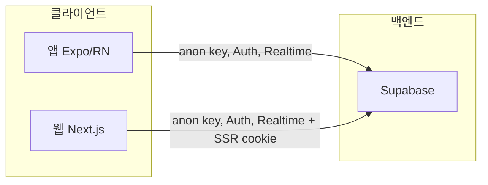
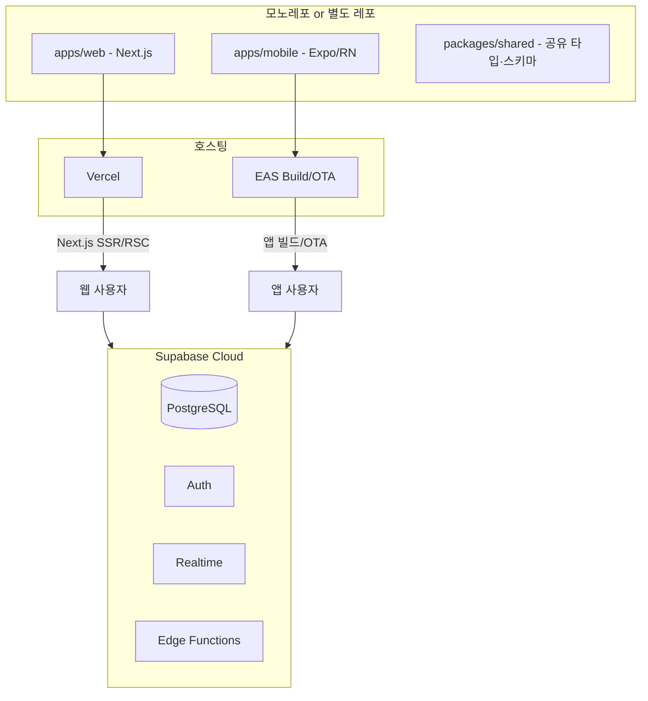

# 은둔마을 웹 연계 및 Vercel 호스팅 설계

앱(Expo)과 동일한 Supabase 백엔드를 사용하는 웹(Next.js)의 목적, 아키텍처, 기술 스택, 개발환경, Vercel 배포, 단계별 기능을 정리합니다.
본 문서는 **현재 앱 기술 스택·Windows 11 개발 환경·실제 역량**을 기반으로 한 설계입니다.

---

## 1. 웹 도입 목적

앱만으로도 사용 가능하므로, 웹은 **다음 세 가지 목적**에 한정한다.

| 목적 | 설명 | 웹에서 제공할 것 |
|------|------|------------------|
| **링크·공유·첫 접촉** | 공유된 링크를 받은 사람이 앱 설치 없이 글을 읽을 수 있게 함 | 게시글 읽기 전용, Open Graph 미리보기 |
| **PC·태블릿 접속** | PC나 큰 화면에서 글쓰기·댓글·반응 참여 | 읽기 + 글쓰기·댓글·반응 (앱과 동일 데이터) |
| **운영 효율** | 그룹 생성, 초대 코드 공유, 검토·통계를 웹에서 처리 | 관리자 전용 페이지 (선택) |

**하지 않는 것**: 앱과 완전 동일 기능을 웹에 모두 구현하는 것, 앱을 웹으로 대체하는 것.
**한 문장 요약**: "공유된 링크를 누구나 바로 보고, PC에서도 참여하고, 운영은 웹에서 하기 위해 웹을 둔다."

---

## 2. 아키텍처

백엔드는 **기존 Supabase 1개**를 유지하고, 앱과 웹이 동시에 접근한다.





- **앱**: 기존 Expo 프로젝트, EAS로 빌드·OTA. 변경 없음.
- **웹**: Next.js (App Router), **Vercel**에 배포. `@supabase/ssr`로 SSR 쿠키 세션 관리.
- **Supabase**: DB, Auth, Realtime, RLS, Storage, Edge Functions — 변경 없음.
- **공유 코드**: `packages/shared`에 타입 정의·Zod 스키마·상수를 두고 앱·웹에서 공통 import (모노레포 선택 시).

---

## 3. 웹 기술 스택

앱의 현재 스택(`TanStack Query`, `Zod`, `React Hook Form`, `Tailwind`, `Sentry`)을 최대한 재활용한다.

| 구분 | 기술 | 비고 |
|------|------|------|
| 프레임워크 | **Next.js 15 (App Router)** | RSC, 동적 라우트, API Route, SEO, 배포 단순 |
| 스타일 | **Tailwind CSS v3** | 앱(NativeWind)과 동일 버전·토큰 유지 권장 |
| 데이터(클라이언트) | **TanStack Query v5** | 앱과 동일 queryKey·invalidation 패턴 |
| 데이터(서버) | **Supabase Server Client** (`@supabase/ssr`) | RSC, Server Actions, Route Handlers에서 사용 |
| 폼/검증 | **React Hook Form + Zod** | 앱과 동일 스키마 재활용 가능 |
| 에디터 | **TipTap** (`@tiptap/react`) | TenTap 기반이 TipTap이므로 HTML 스키마 완전 호환 |
| 인증 | **Supabase Auth + @supabase/ssr** | 쿠키 기반 세션, 익명·이메일 로그인 |
| 모니터링 | **Sentry** (`@sentry/nextjs`) | 앱과 동일 프로젝트 or 별도 프로젝트 |
| 분석 | **Vercel Analytics + Speed Insights** | `@vercel/analytics`, `@vercel/speed-insights` |
| 언어 | TypeScript | 앱과 동일 버전 (`~5.9.x`) |

### 3.1 에디터 스택 선택 근거 (TipTap)

앱의 `@10play/tentap-editor`는 TipTap을 React Native에 포팅한 라이브러리다.
두 에디터 모두 같은 HTML 스키마(`<p>`, `<strong>`, `<em>`, `<blockquote>`, `<ul>`, `<ol>`, `<h2>`, `<h3>` 등)를 사용하므로 DB에 저장된 HTML이 앱·웹에서 동일하게 렌더된다.

```
앱 (TenTap) → HTML 저장 → Supabase posts.content
웹 (TipTap) → 동일 HTML 읽기/쓰기 → 앱과 동일 렌더
```

---

## 4. 개발환경 세팅 (Windows 11)

### 4.1 Node.js 버전 관리

현재 앱이 Node >= 18을 요구한다. Windows에서는 **fnm**(Fast Node Manager)을 권장한다.

```bash
# winget으로 fnm 설치
winget install Schniz.fnm

# 환경 변수 초기화 (PowerShell 프로필에 추가)
# ~/.bashrc (Git Bash) 또는 PowerShell $PROFILE에:
eval "$(fnm env --use-on-cd)"

# Node 22 LTS 설치 및 사용
fnm install 22
fnm use 22
fnm default 22
```

> **WSL2 권장**: Windows에서 Next.js 개발 시 파일 감시(hot reload) 성능이 WSL2 환경에서 유의미하게 빠르다.
> WSL2 사용 시 프로젝트를 `/home/user/...` (WSL 파일시스템) 경로에 두고 VS Code Remote - WSL 확장으로 작업한다.

### 4.2 웹 프로젝트 초기 생성

```bash
# apps/web 디렉터리에 Next.js 프로젝트 생성
npx create-next-app@latest apps/web \
  --typescript \
  --tailwind \
  --app \
  --src-dir \
  --import-alias "@/*"

# 주요 의존성 설치
cd apps/web
npm install @supabase/supabase-js @supabase/ssr
npm install @tanstack/react-query @tanstack/react-query-devtools
npm install react-hook-form @hookform/resolvers zod
npm install @tiptap/react @tiptap/pm @tiptap/starter-kit @tiptap/extension-link @tiptap/extension-image
npm install @sentry/nextjs
npm install @vercel/analytics @vercel/speed-insights
```

### 4.3 VS Code 권장 확장

앱 개발에 이미 사용 중인 확장 외에 웹용으로 추가한다.

```json
// .vscode/extensions.json (웹 프로젝트)
{
  "recommendations": [
    "bradlc.vscode-tailwindcss",
    "dbaeumer.vscode-eslint",
    "esbenp.prettier-vscode",
    "ms-vscode.vscode-typescript-next",
    "csstools.postcss",
    "ms-vscode-remote.remote-wsl"
  ]
}
```

### 4.4 로컬 Supabase 연동

웹 개발 시에도 앱과 동일한 로컬 Supabase를 사용할 수 있다.

```bash
# 앱 레포 루트에서 로컬 Supabase 실행 (이미 설정됨)
supabase start
# → API URL: http://127.0.0.1:54321
# → anon key: eyJ...

# 웹 .env.local
NEXT_PUBLIC_SUPABASE_URL=http://127.0.0.1:54321
NEXT_PUBLIC_SUPABASE_ANON_KEY=eyJ...
```

---

## 5. 모노레포 구조 (선택 권장)

웹은 **앱 레포와 분리**하는 것도 가능하지만, 타입·스키마 공유와 유지보수를 위해 **Turborepo 모노레포**를 권장한다.
Turborepo는 Vercel 제품이므로 Vercel 배포와 캐시 통합이 자연스럽다.

### 5.1 디렉터리 구조

```
hermit-comm/                  ← 모노레포 루트
├── apps/
│   ├── mobile/               ← 기존 Expo 프로젝트 (현재 레포 내용)
│   └── web/                  ← Next.js 웹 앱 (신규)
├── packages/
│   └── shared/               ← 공유 타입·Zod 스키마·상수
│       ├── src/
│       │   ├── types/        ← Post, Comment, Board, Reaction 등
│       │   ├── schemas/      ← Zod 스키마 (앱·웹 동일)
│       │   └── constants.ts  ← DEFAULT_PUBLIC_BOARD_ID 등
│       └── package.json
├── turbo.json
└── package.json
```

### 5.2 Turborepo 초기화

```bash
# 기존 레포를 모노레포로 전환하는 경우
npx create-turbo@latest  # 새 레포에서 시작

# turbo.json
{
  "tasks": {
    "build": { "dependsOn": ["^build"], "outputs": [".next/**"] },
    "dev": { "cache": false, "persistent": true },
    "type-check": { "dependsOn": ["^build"] },
    "lint": {}
  }
}
```

> **단순 분리 방식**: 모노레포가 부담스럽다면 `apps/web`을 **별도 GitHub 레포**로 만들고,
> `packages/shared` 대신 타입을 복사해서 시작해도 된다. Phase 1에서는 이 방식으로 충분하다.

---

## 6. Vercel 배포

### 6.1 배포 방식

- **연동**: Vercel 대시보드에서 GitHub 저장소 연결 → 자동 빌드·배포.
- **빌드**: `next build`, 출력 `.next` (기본값).
- **프리뷰**: PR별 프리뷰 URL 자동 생성. 개발·검토 시 활용.
- **모노레포**: Vercel 프로젝트 설정에서 Root Directory를 `apps/web`으로 지정.

### 6.2 환경 변수

| 변수명 | 필수 | 설명 |
|--------|------|------|
| `NEXT_PUBLIC_SUPABASE_URL` | 예 | Supabase 프로젝트 URL |
| `NEXT_PUBLIC_SUPABASE_ANON_KEY` | 예 | Supabase anon key |
| `SUPABASE_SERVICE_ROLE_KEY` | 서버 전용 | 관리자 Server Actions에서만. **절대 클라이언트 노출 금지** |
| `NEXT_PUBLIC_APP_URL` | 예 | 배포 URL (OG, 리디렉트용) |

> Production / Preview / Development 환경별로 구분해 등록한다.
> `SUPABASE_SERVICE_ROLE_KEY`는 Server Component·Route Handler에서만, 절대 `NEXT_PUBLIC_` 접두사 사용 금지.

### 6.3 도메인

- 기본: `*.vercel.app` 도메인 자동 제공.
- 커스텀: Vercel에서 커스텀 도메인 연결 (예: `hermit.example.com`).

### 6.4 Supabase CORS 설정

Supabase 대시보드 → Authentication → URL Configuration에 웹 배포 도메인 추가:

```
https://*.vercel.app      # 프리뷰 URL
https://hermit.example.com  # 커스텀 도메인
```

---

## 7. CI/CD (GitHub Actions)

앱 레포의 기존 `npm test` + `tsc` 파이프라인과 별개로, 웹 레포(또는 모노레포)에 추가한다.

```yaml
# .github/workflows/web-ci.yml
name: Web CI

on:
  push:
    branches: [main]
    paths: ['apps/web/**', 'packages/shared/**']
  pull_request:
    paths: ['apps/web/**', 'packages/shared/**']

jobs:
  check:
    runs-on: ubuntu-latest
    steps:
      - uses: actions/checkout@v4
      - uses: actions/setup-node@v4
        with:
          node-version: 22
          cache: 'npm'
      - run: npm ci
      - run: npx tsc --noEmit
        working-directory: apps/web
      - run: npm run lint
        working-directory: apps/web
      - run: npm test
        working-directory: apps/web
```

> Vercel은 GitHub 연동 시 PR 자동 프리뷰를 지원하므로, CI는 **타입 체크·린트·테스트**만 담당하고 배포는 Vercel에 위임한다.

---

## 8. 기능 단계 (Phase)

| Phase | 목표 | 웹 기능 | 비고 |
|-------|------|---------|------|
| **1** | 링크 공유·읽기 | 공개 게시글 읽기 전용, `/post/[id]`, Open Graph 메타 | 설치 없이 첫 경험. RSC로 구현 |
| **2** | PC 참여 | 글쓰기·댓글·반응 (익명 로그인), 목록·검색·정렬 | 앱과 동일 API |
| **3** | 그룹 | 그룹 목록·그룹 게시판·초대 코드 참여 | RLS 그대로 |
| **4** | 운영 (선택) | 관리자 로그인, 그룹 생성·초대 코드·검토 큐·통계 | Server Actions 활용 |

우선 **Phase 1**만 목표로 두고, 링크로 들어온 사용자가 글만 읽을 수 있게 한 뒤, 필요 시 Phase 2·3·4를 확장한다.

---

## 9. 인증·세션

### 9.1 Supabase SSR 패턴 (Next.js App Router)

Next.js App Router + `@supabase/ssr`의 쿠키 기반 세션을 사용한다.

```typescript
// src/lib/supabase/server.ts  ← Server Component / Route Handler용
import { createServerClient } from '@supabase/ssr'
import { cookies } from 'next/headers'

export function createClient() {
  const cookieStore = cookies()
  return createServerClient(
    process.env.NEXT_PUBLIC_SUPABASE_URL!,
    process.env.NEXT_PUBLIC_SUPABASE_ANON_KEY!,
    {
      cookies: {
        getAll: () => cookieStore.getAll(),
        setAll: (cs) => cs.forEach(({ name, value, options }) =>
          cookieStore.set(name, value, options)
        ),
      },
    }
  )
}

// src/lib/supabase/client.ts  ← Client Component용
import { createBrowserClient } from '@supabase/ssr'

export function createClient() {
  return createBrowserClient(
    process.env.NEXT_PUBLIC_SUPABASE_URL!,
    process.env.NEXT_PUBLIC_SUPABASE_ANON_KEY!
  )
}
```

```typescript
// middleware.ts  ← 세션 쿠키 갱신 (루트에 위치)
import { createServerClient } from '@supabase/ssr'
import { NextResponse, type NextRequest } from 'next/server'

export async function middleware(request: NextRequest) {
  let supabaseResponse = NextResponse.next({ request })
  const supabase = createServerClient(
    process.env.NEXT_PUBLIC_SUPABASE_URL!,
    process.env.NEXT_PUBLIC_SUPABASE_ANON_KEY!,
    {
      cookies: {
        getAll: () => request.cookies.getAll(),
        setAll: (cs) => cs.forEach(({ name, value, options }) =>
          supabaseResponse.cookies.set(name, value, options)
        ),
      },
    }
  )
  await supabase.auth.getUser()  // 세션 갱신
  return supabaseResponse
}

export const config = {
  matcher: ['/((?!_next/static|_next/image|favicon.ico).*)'],
}
```

### 9.2 익명 사용자

- 웹: Supabase `signInAnonymously` 호출, **브라우저별 쿠키 세션**.
- 앱과 웹 세션은 **별개** (같은 사람이 앱·웹에서 동일 계정 공유 기능 없음).

### 9.3 관리자

- 이메일/비밀번호로 로그인. `app_admin` 테이블로 권한 판단 — 앱과 동일.
- Server Component에서 `createClient().auth.getUser()` 후 `app_admin` 테이블 조회.

### 9.4 공유 링크

- URL: `https://웹도메인/post/[id]`.
- 미로그인도 RLS가 허용하면 읽기 가능 (Phase 1 목표).
- 앱 설치 유도: `<meta name="apple-itunes-app">` / `<meta name="google-play-app">` 스마트 배너 추가 (아래 섹션 참고).

---

## 10. 프로젝트 구조 (웹)

```
apps/web/
├── src/
│   ├── app/                        # Next.js App Router
│   │   ├── layout.tsx              # 루트 레이아웃 (Analytics, Sentry 초기화)
│   │   ├── page.tsx                # 랜딩 또는 공개 게시판 목록
│   │   ├── post/
│   │   │   └── [id]/
│   │   │       └── page.tsx        # 게시글 상세 (RSC, OG 메타)
│   │   ├── groups/                 # (Phase 3)
│   │   │   ├── page.tsx
│   │   │   └── [groupId]/page.tsx
│   │   └── admin/                  # (Phase 4)
│   │       ├── login/page.tsx
│   │       └── page.tsx
│   ├── components/
│   │   ├── post/
│   │   │   ├── PostCard.tsx        # 목록 카드
│   │   │   ├── PostBody.tsx        # 본문 렌더 (HTML → React)
│   │   │   └── PostEditor.tsx      # TipTap 에디터 (Phase 2)
│   │   ├── comment/
│   │   └── ui/                     # Button, Input 등 공통 UI
│   ├── lib/
│   │   ├── supabase/
│   │   │   ├── server.ts           # Server Component용 클라이언트
│   │   │   └── client.ts           # Client Component용 클라이언트
│   │   ├── queryClient.ts          # TanStack Query 설정
│   │   └── api/                    # 웹용 API 함수 (앱 api.ts 구조 미러)
│   ├── hooks/                      # useAuth, useCurrentUser 등
│   └── types/                      # 웹 전용 타입 (or packages/shared에서 import)
├── middleware.ts                    # Supabase 세션 갱신
├── .env.local                       # 로컬 환경변수
├── next.config.ts
├── tailwind.config.ts
└── tsconfig.json
```

---

## 11. Server Components / Client Components 분리 전략

Next.js App Router에서 어떤 컴포넌트를 서버·클라이언트로 둘지 명확히 한다.

| 컴포넌트 | 구분 | 이유 |
|----------|------|------|
| `post/[id]/page.tsx` | **Server Component** | DB 조회, OG 메타 생성 (SEO) |
| `PostBody.tsx` | **Server Component** | HTML 렌더만, 인터랙션 없음 |
| `PostCard.tsx` | **Server Component** | 목록 렌더만 |
| `PostEditor.tsx` | **Client Component** (`'use client'`) | TipTap은 브라우저 DOM 필요 |
| `CommentList.tsx` | **Client Component** | Realtime 구독, 폼 인터랙션 |
| `ReactionBar.tsx` | **Client Component** | 클릭 이벤트, Optimistic Update |
| `AuthProvider.tsx` | **Client Component** | Supabase 클라이언트 세션 관리 |

### 11.1 데이터 페칭 패턴

```typescript
// Phase 1: RSC에서 직접 조회 (TanStack Query 불필요)
// app/post/[id]/page.tsx
export default async function PostPage({ params }: { params: { id: string } }) {
  const supabase = createClient()  // server.ts
  const { data: post } = await supabase
    .from('posts')
    .select('*, boards(name, anon_mode)')
    .eq('id', params.id)
    .single()

  if (!post) notFound()
  return <PostBody post={post} />
}

// Phase 2+: 클라이언트 인터랙션 (TanStack Query)
// components/comment/CommentList.tsx ('use client')
export function CommentList({ postId }: { postId: string }) {
  const { data: comments } = useQuery({
    queryKey: ['comments', postId],
    queryFn: () => getComments(postId),
  })
  // ...
}
```

---

## 12. 공유 타입 전략

앱(`src/types/index.ts`)과 웹이 동일한 `Post`, `Comment`, `Board` 타입을 사용해야 한다.

### 12.1 단기 (복사 방식)

Phase 1에서는 앱의 `src/types/index.ts`를 웹의 `src/types/index.ts`에 복사해 시작한다.
DB 스키마 변경 시 양쪽을 함께 업데이트한다.

### 12.2 중기 (Supabase 자동 생성)

```bash
# DB 타입 자동 생성 — 앱·웹 모두 동일 파일 참조
npx supabase gen types typescript \
  --project-id YOUR_PROJECT_ID \
  --schema public \
  > src/types/supabase.ts
```

### 12.3 장기 (모노레포 공유 패키지)

```typescript
// packages/shared/src/types/index.ts
export type Post = { id: string; title: string; content: string; /* ... */ }
export type Comment = { /* ... */ }

// apps/mobile/src/features/posts/...
import type { Post } from '@hermit/shared'

// apps/web/src/types/...
import type { Post } from '@hermit/shared'
```

---

## 13. Open Graph / SEO (Phase 1 핵심)

Phase 1의 가장 중요한 목적인 "공유 링크로 글 미리보기"를 위해 OG 메타를 필수로 구현한다.

```typescript
// app/post/[id]/page.tsx
import type { Metadata } from 'next'

export async function generateMetadata(
  { params }: { params: { id: string } }
): Promise<Metadata> {
  const supabase = createClient()
  const { data: post } = await supabase
    .from('posts')
    .select('title, content')
    .eq('id', params.id)
    .single()

  const excerpt = stripHtml(post?.content ?? '').slice(0, 120)

  return {
    title: post?.title ?? '은둔마을',
    description: excerpt,
    openGraph: {
      title: post?.title ?? '은둔마을',
      description: excerpt,
      url: `${process.env.NEXT_PUBLIC_APP_URL}/post/${params.id}`,
      siteName: '은둔마을',
      locale: 'ko_KR',
      type: 'article',
    },
  }
}
```

---

## 14. PWA + 스마트 앱 배너

웹에서 앱 다운로드를 자연스럽게 유도한다.

### 14.1 스마트 앱 배너

```html
<!-- app/layout.tsx head에 추가 -->
<!-- iOS Safari 스마트 배너 -->
<meta name="apple-itunes-app" content="app-id=YOUR_APP_STORE_ID" />
<!-- Android Chrome (커스텀 배너 또는 Google Play 링크) -->
```

### 14.2 PWA (선택)

```bash
npm install next-pwa
```

```typescript
// next.config.ts
import withPWA from 'next-pwa'

export default withPWA({
  dest: 'public',
  disable: process.env.NODE_ENV === 'development',
})({
  // 기타 Next.js 설정
})
```

PWA manifest (`public/manifest.json`):

```json
{
  "name": "은둔마을",
  "short_name": "은둔마을",
  "description": "익명 커뮤니티",
  "start_url": "/",
  "display": "standalone",
  "background_color": "#ffffff",
  "theme_color": "#000000",
  "icons": [
    { "src": "/icon-192.png", "sizes": "192x192", "type": "image/png" },
    { "src": "/icon-512.png", "sizes": "512x512", "type": "image/png" }
  ]
}
```

---

## 15. 모니터링·에러 추적

앱에서 이미 Sentry를 사용 중이므로 웹에도 동일하게 적용한다.

### 15.1 Sentry (Next.js)

```bash
npm install @sentry/nextjs
npx @sentry/wizard@latest -i nextjs
```

```typescript
// sentry.server.config.ts
import * as Sentry from '@sentry/nextjs'

Sentry.init({
  dsn: process.env.NEXT_PUBLIC_SENTRY_DSN,
  environment: process.env.NODE_ENV,
  tracesSampleRate: 0.1,
})
```

### 15.2 Vercel Analytics + Speed Insights

```typescript
// app/layout.tsx
import { Analytics } from '@vercel/analytics/react'
import { SpeedInsights } from '@vercel/speed-insights/next'

export default function RootLayout({ children }) {
  return (
    <html lang="ko">
      <body>
        {children}
        <Analytics />
        <SpeedInsights />
      </body>
    </html>
  )
}
```

---

## 16. 호스팅 요약

| 대상 | 호스팅 | 비고 |
|------|--------|------|
| **웹(Next.js)** | **Vercel** | Git 연동, 무료 티어, Next.js 최적화 |
| **백엔드** | Supabase Cloud | 기존 유지 |
| **앱** | EAS (빌드·OTA) | 스토어 제출·업데이트 |

---

## 17. 관련 설계 보완 (참고)

### 17.1 사용자 참여·재방문을 위한 서비스

- **푸시 알림** (Expo Notifications): "내 글에 댓글", "비슷한 감정의 새 글", "오늘 한 줄" 등.
- **위기 지원 안내**: 생명의전화(1393), 자살예방상담(1577-0199) 등 링크/문구 노출 (특정 감정 글 진입 시 등).
- **오늘의 한 줄 / 감정 체크인**: 앱 진입 시 짧은 프롬프트로 진입 장벽 완화.
- **가벼운 인정**: 연속 기록·배지 문구 (기존 posts/reactions 집계 활용).
- **내 글 백업**: 본인 글 다운로드(텍스트/PDF)로 신뢰·장기 사용 유도.

### 17.2 AI API 활용 방향

- **기존**: Anthropic Claude — 게시글 감정 분석 (Edge Function `analyze-post`).
- **확장 권장**: 동일 호출에서 감정 + 한 줄 요약 + 검토 플래그(위험/유해) 구조화 출력.
- **의미 검색**: Embedding API(OpenAI/Voyage) + pgvector로 키워드 검색 보완.
- **모더레이션**: 차단보다 "검토 큐" 플래그 위주. 익명·감정 커뮤니티 특성상 오탐 최소화 정책 권장.
- **웹 수동 재분석**: Phase 4 관리자 페이지에서 `invokeSmartService('analyze-post-on-demand')` 버튼 제공 가능.

### 17.3 운영자 웹 (Laravel 선택 시)

- 관리자 전용을 **Laravel + Blade/Inertia**로 구현하는 경우: 그룹·초대 코드·검토 큐·통계를 웹에서 처리.
- 호스팅: Railway, Render 또는 국내 클라우드(Naver Cloud, NHN Cloud) VM.
- 앱·일반 웹(Next.js)은 Supabase 직결 유지, Laravel은 운영 전용으로 두는 구성이 가능하다.

### 17.4 웹용 Rate Limiting (Vercel Edge Middleware)

```typescript
// middleware.ts에 추가
import { Ratelimit } from '@upstash/ratelimit'
import { Redis } from '@upstash/redis'

const ratelimit = new Ratelimit({
  redis: Redis.fromEnv(),
  limiter: Ratelimit.slidingWindow(20, '10 s'),
})

// POST /api/... 경로에 Rate Limit 적용
```

> Upstash Redis는 Vercel 마켓플레이스에서 바로 연동 가능. Phase 2+ 글쓰기 API 보호 시 추가한다.

---

## 18. Phase 1 빠른 시작 체크리스트

Phase 1 목표(공개 게시글 읽기 + OG)를 최단 시간에 달성하기 위한 순서:

- [ ] `apps/web` Next.js 프로젝트 생성 (위 4.2 명령어)
- [ ] `src/lib/supabase/server.ts` + `client.ts` 작성
- [ ] `middleware.ts` 세션 갱신 설정
- [ ] `app/post/[id]/page.tsx` — RSC로 게시글 조회
- [ ] `generateMetadata` — OG 메타 (`title`, `description`, `openGraph`)
- [ ] `PostBody.tsx` — HTML 렌더 (`dangerouslySetInnerHTML` 또는 `html-react-parser`)
- [ ] Tailwind 설정 — 앱 `DESIGN_TOKENS.md` 토큰 맞추기
- [ ] Vercel 프로젝트 생성 + 환경 변수 등록
- [ ] Supabase → Authentication → URL Configuration에 Vercel 도메인 추가
- [ ] 카카오톡·슬랙에서 공유 링크 OG 미리보기 확인

---

## 19. 문서·참고

| 문서 | 용도 |
|------|------|
| [ARCHITECTURE.md](ARCHITECTURE.md) | 앱 기술 스택·폴더 구조·API 레이어 |
| [supabase_setup.md](supabase_setup.md) | Supabase 프로젝트·마이그레이션·RLS (웹도 동일 프로젝트 사용) |
| [APP_USAGE_GUIDE.md](APP_USAGE_GUIDE.md) | 사용자·운영자 앱 사용법 |
| [DEPLOY_CHECKLIST.md](DEPLOY_CHECKLIST.md) | 앱 프로덕션 배포 체크리스트 |
| [DESIGN_TOKENS.md](DESIGN_TOKENS.md) | 앱 디자인 토큰 (웹 Tailwind 설정 시 참고) |
| [ROADMAP.md](../ROADMAP.md) | 단기·중기·장기 기능 목록 |

이 설계를 기준으로 웹 프로젝트를 생성하고, Phase 1부터 순차 적용하면 된다.
