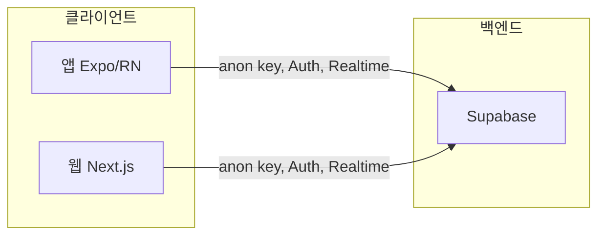
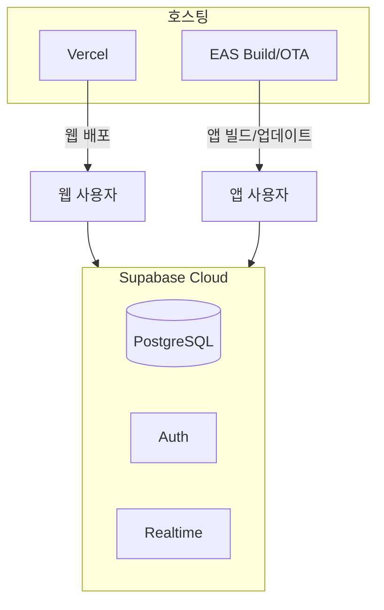

# 은둔마을 웹 연계 및 Vercel 호스팅 설계

앱(Expo)과 동일한 Supabase 백엔드를 사용하는 웹(Next.js)의 목적, 아키텍처, 기술 스택, Vercel 배포, 단계별 기능을 정리합니다.  
본 문서는 세션 논의를 바탕으로 한 **최종 추천 설계**입니다.

---

## 1. 웹 도입 목적

앱만으로도 사용 가능하므로, 웹은 **다음 세 가지 목적**에 한정한다.

| 목적 | 설명 | 웹에서 제공할 것 |
|------|------|------------------|
| **링크·공유·첫 접촉** | 공유된 링크를 받은 사람이 앱 설치 없이 글을 읽을 수 있게 함 | 게시글 읽기 전용, Open Graph 미리보기 |
| **PC·태블릿 접속** | PC나 큰 화면에서 글쓰기·댓글·반응 참여 | 읽기 + 글쓰기·댓글·반응 (앱과 동일 데이터) |
| **운영 효율** | 그룹 생성, 초대 코드 공유, 검토·통계를 웹에서 처리 | 관리자 전용 페이지 (선택) |

**하지 않는 것**: 앱과 완전 동일 기능을 웹에 모두 구현하는 것, 앱을 웹으로 대체하는 것.  
**한 문장 요약**: "공유된 링크를 누구나 바로 보고, PC에서도 참여하고, 운영은 웹에서 하기 위해 웹을 둔다."

---

## 2. 아키텍처

백엔드는 **기존 Supabase 1개**를 유지하고, 앱과 웹이 동시에 접근한다.





- **앱**: 기존 Expo 프로젝트, EAS로 빌드·OTA. 호스팅은 EAS가 담당.
- **웹**: Next.js 단일 앱, **Vercel**에 배포.
- **Supabase**: DB, Auth, Realtime, RLS, Storage, Edge Functions — 변경 없음.

---

## 3. 웹 기술 스택 (추천)

| 구분 | 기술 | 비고 |
|------|------|------|
| 프레임워크 | Next.js (App Router) | SEO, 동적 라우트, API Route, 배포 단순 |
| 스타일 | Tailwind CSS | 앱(NativeWind)과 디자인 토큰 맞추기 용이 |
| 데이터 | TanStack Query + Supabase JS | 앱과 동일 패턴(queryKey, invalidation) |
| 폼/검증 | React Hook Form + Zod | 앱과 동일, 스키마 공유 가능 |
| 에디터 | TipTap 또는 Lexical | 웹용 리치 텍스트, 앱과 동일 HTML 스키마 저장 |
| 인증 | Supabase Auth (JS) | 익명 로그인, 관리자 이메일/비밀번호 |
| 언어 | TypeScript | 앱과 동일 |

---

## 4. Vercel 배포

### 4.1 배포 방식

- **연동**: Vercel 대시보드에서 GitHub/GitLab 등 저장소 연결 후 자동 빌드·배포.
- **빌드**: `next build`, 출력 `.next` (기본값).
- **프리뷰**: PR별 프리뷰 URL 자동 생성.

### 4.2 환경 변수

| 변수명 | 필수 | 설명 |
|--------|------|------|
| `NEXT_PUBLIC_SUPABASE_URL` | 예 | Supabase 프로젝트 URL (앱과 동일) |
| `NEXT_PUBLIC_SUPABASE_ANON_KEY` | 예 | Supabase anon key (앱과 동일) |

Vercel 프로젝트 설정 → Environment Variables에서 등록. Production / Preview / Development 구분 가능.

### 4.3 도메인

- 기본: `*.vercel.app` 도메인 제공.
- 커스텀: Vercel에서 커스텀 도메인 연결 (예: `hermit.example.com`).

### 4.4 참고

- Supabase CORS: Supabase 대시보드에서 웹 배포 도메인을 허용 목록에 추가할 것.
- 앱과 **동일한 Supabase 프로젝트**를 사용하므로, RLS·Auth 정책은 그대로 적용됨.

---

## 5. 기능 단계 (Phase)

| Phase | 목표 | 웹 기능 | 비고 |
|-------|------|---------|------|
| **1** | 링크 공유·읽기 | 공개 게시글 읽기 전용, `/post/[id]`, Open Graph 메타 | 설치 없이 첫 경험 |
| **2** | PC 참여 | 글쓰기·댓글·반응 (익명 로그인), 목록·검색 | 앱과 동일 API |
| **3** | 그룹 | 그룹 목록·그룹 게시판·초대 코드 참여 | RLS 그대로 |
| **4** | 운영 (선택) | 관리자 로그인, 그룹 생성·초대 코드·검토 큐·통계 | Laravel 등 별도도 가능 |

우선 **Phase 1**만 목표로 두고, 링크로 들어온 사용자가 글만 읽을 수 있게 한 뒤, 필요 시 Phase 2·3·4를 확장한다.

---

## 6. 인증·세션

- **익명 사용자**
  - 웹: Supabase `signInAnonymously` 호출, 브라우저별 세션.
  - 앱과 웹 세션은 **별개** (같은 사람이 앱과 웹에서 동일 계정으로 쓰는 기능은 기본 제공하지 않음).
- **관리자**
  - 이메일/비밀번호로 로그인. `app_admin` 테이블로 권한 판단 — 앱과 동일.
- **공유 링크**
  - URL: `https://웹도메인/post/[id]`.
  - 미로그인도 RLS가 허용하면 읽기 가능.
  - 앱 설치 시: 딥링크(`hermitcomm://post/[id]`)로 앱 열기, 미설치 시 웹 유지 또는 스토어 유도.

---

## 7. 프로젝트 구조 (웹)

웹은 **앱 레포와 분리**하는 것을 권장 (별도 저장소 또는 모노레포 `apps/web`).  
앱의 feature 구조와 맞추면 유지보수에 유리하다.

```
apps/web/   (또는 웹 전용 레포 루트)
├── app/              # Next.js App Router
│   ├── page.tsx      # 랜딩 또는 목록
│   ├── post/[id]/    # 게시글 상세
│   ├── groups/       # (Phase 3)
│   └── admin/        # (Phase 4, 선택)
├── components/
├── lib/              # supabase 클라이언트, api 래퍼
├── types/            # Post, Comment 등 (앱과 동일 타입 정의 또는 공유 패키지)
└── public/
```

모노레포인 경우 `packages/shared`에 타입·Zod 스키마·상수를 두고 앱과 웹에서 공통 import할 수 있다.

---

## 8. 호스팅 요약

| 대상 | 호스팅 | 비고 |
|------|--------|------|
| **웹(Next.js)** | **Vercel** | Git 연동, 무료 티어, Next.js 최적화 |
| **백엔드** | Supabase Cloud | 기존 유지 |
| **앱** | EAS (빌드·OTA) | 스토어 제출·업데이트 |

---

## 9. 관련 설계 보완 (참고)

웹·호스팅과 함께 논의된 내용 중, 별도 문서로 확장할 수 있는 항목만 요약한다.

### 9.1 사용자 참여·재방문을 위한 서비스

- **푸시 알림** (Expo Notifications): "내 글에 댓글", "비슷한 감정의 새 글", "오늘 한 줄" 등.
- **위기 지원 안내**: 생명의전화(1393), 자살예방상담(1577-0199) 등 링크/문구 노출 (특정 감정 글 진입 시 등).
- **오늘의 한 줄 / 감정 체크인**: 앱 진입 시 짧은 프롬프트로 진입 장벽 완화.
- **가벼운 인정**: 연속 기록·배지 문구 (기존 posts/reactions 집계 활용).
- **내 글 백업**: 본인 글 다운로드(텍스트/PDF)로 신뢰·장기 사용 유도.

### 9.2 AI API 활용 방향

- **기존**: Anthropic Claude — 게시글 감정 분석.
- **확장 권장**: 동일 호출에서 감정 + 한 줄 요약 + 검토 플래그(위험/유해) 구조화 출력.
- **의미 검색**: Embedding API(OpenAI/Voyage) + pgvector로 키워드 검색 보완.
- **모더레이션**: 차단보다 "검토 큐" 플래그 위주. 익명·감정 커뮤니티 특성상 오탐 최소화 정책 권장.

### 9.3 운영자 웹 (Laravel 선택)

- 관리자 전용을 **Laravel + Blade/Inertia**로 구현하는 경우: 그룹·초대 코드·검토 큐·통계를 웹에서 처리.
- 호스팅: Railway, Render 또는 국내 클라우드(Naver Cloud, NHN Cloud) VM.
- 앱·일반 웹(Next.js)은 Supabase 직결 유지, Laravel은 운영 전용으로 두는 구성이 가능하다.

---

## 10. 문서·참고

| 문서 | 용도 |
|------|------|
| [ARCHITECTURE.md](ARCHITECTURE.md) | 앱 기술 스택·폴더 구조·API 레이어 |
| [supabase_setup.md](supabase_setup.md) | Supabase 프로젝트·마이그레이션·RLS (웹도 동일 프로젝트 사용) |
| [APP_USAGE_GUIDE.md](APP_USAGE_GUIDE.md) | 사용자·운영자 앱 사용법 |
| [ROADMAP.md](../ROADMAP.md) | 단기·중기·장기 기능 목록 |

이 설계를 기준으로 웹 프로젝트를 생성하고, Phase 1부터 순차 적용하면 된다.
