# Supabase 설정 가이드

은둔마을 앱은 Supabase를 백엔드로 사용합니다. 이 가이드는 Supabase 프로젝트를 설정하고 앱에 연동하는 방법을 안내합니다.

## 1. Supabase 프로젝트 생성

1. [Supabase 대시보드](https://supabase.com/dashboard)에 로그인하세요
2. "New Project" 버튼을 클릭하세요
3. 프로젝트 정보를 입력하세요:
   - **Name**: `hermit-comm` (또는 원하는 이름)
   - **Database Password**: 안전한 비밀번호 생성
   - **Region**: `Northeast Asia (Seoul)` 또는 가까운 리전 선택
4. "Create new project" 버튼을 클릭하세요
5. 프로젝트 생성이 완료될 때까지 대기하세요 (약 2분 소요)

## 2. API 키 확인

프로젝트가 생성되면:

1. 왼쪽 메뉴에서 **Settings** → **API**로 이동하세요
2. 다음 정보를 확인하세요:
   - **Project URL**: `https://your-project-id.supabase.co`
   - **Publishable (anon) key**: `sb_publishable_...` 또는 `eyJhbGci...`로 시작하는 키

⚠️ **주의**: `secret` 또는 `service_role` 키는 절대 클라이언트에 포함하지 마세요!

## 3. 데이터베이스 스키마 생성

**권장**: Supabase CLI를 사용하는 경우 프로젝트 루트에서 `supabase db migrate up`으로 001~008 마이그레이션을 순서대로 적용할 수 있습니다.

### SQL Editor에서 수동 실행

CLI를 쓰지 않을 경우, **SQL Editor**에서 아래 순서대로 각 파일 내용을 복사·실행하세요.

1. 왼쪽 메뉴에서 **SQL Editor**로 이동
2. `supabase/migrations/001_initial_schema.sql` ~ `008_admin_rls.sql`을 **번호 순서대로** 각각 새 쿼리로 붙여넣고 "Run" 실행

마이그레이션 목록과 요약은 [supabase/migrations/README.md](../supabase/migrations/README.md)를 참고하세요.

### 001 적용 시 생성되는 테이블

- **posts**: 게시글 정보 (id, title, content, author, created_at)
- **comments**: 댓글 정보 (id, post_id, content, author, created_at)
- **reactions**: 반응 정보 (id, post_id, reaction_type, count)

## 4. Realtime 활성화

실시간 업데이트 기능을 사용하려면:

1. 왼쪽 메뉴에서 **Database** → **Replication**으로 이동하세요
2. 다음 테이블에 대해 Realtime을 활성화하세요:
   - `posts` 테이블 옆의 토글 버튼 클릭 ✅
   - `comments` 테이블 옆의 토글 버튼 클릭 ✅
   - `reactions` 테이블 옆의 토글 버튼 클릭 ✅

## 5. 환경 변수 설정

### 로컬 개발

프로젝트 루트에 `.env` 파일을 생성하고 다음 내용을 추가하세요:

```bash
EXPO_PUBLIC_SUPABASE_URL=https://your-project-id.supabase.co
EXPO_PUBLIC_SUPABASE_ANON_KEY=sb_publishable_xxxxxxxxxx
```

`.env` 파일은 Git에 커밋하지 마세요! (`.gitignore`에 이미 포함됨)

### 프로덕션 배포

EAS Build를 사용하는 경우, `eas.json`에 환경 변수를 추가하세요:

```json
{
  "build": {
    "production": {
      "env": {
        "EXPO_PUBLIC_SUPABASE_URL": "https://your-project-id.supabase.co",
        "EXPO_PUBLIC_SUPABASE_ANON_KEY": "sb_publishable_xxxxxxxxxx"
      }
    }
  }
}
```

## 6. 앱 실행

환경 변수 설정 후 앱을 다시 시작하세요:

```bash
# Metro 캐시 클리어 후 시작
npx expo start --clear
```

## 7. RLS (Row Level Security) 정책 및 익명 인증

### 개요

은둔마을 앱은 **익명 커뮤니티** 컨셉을 유지하면서도 보안을 강화하기 위해 **Supabase 익명 인증**을 사용합니다.

### 인증 방식

- **Supabase 익명 인증** (`signInAnonymously()`)
- 앱 시작 시 자동으로 익명 세션 생성
- 각 사용자는 고유한 UUID 획득 (로그인 불필요)
- 닉네임은 여전히 사용자가 입력 (익명성 유지)

### 보안 정책

1. **읽기**: 누구나 모든 게시글/댓글 조회 가능 (공개 커뮤니티)
2. **쓰기**: 인증된 사용자만 작성 가능 (익명 사용자 포함)
3. **삭제**: 작성자 본인(`auth.uid()`)만 삭제 가능
4. **작성자 위조 방지**: `author_id`는 서버에서 자동 설정, 클라이언트에서 변경 불가

### 마이그레이션 실행

새로운 RLS 정책을 적용하려면 다음 마이그레이션을 실행하세요:

1. Supabase 대시보드의 **SQL Editor**로 이동
2. `supabase/migrations/002_add_auth_and_rls.sql` 파일의 내용을 복사
3. SQL Editor에 붙여넣기
4. "Run" 버튼 클릭

### 스키마 변경사항

마이그레이션은 다음 변경사항을 적용합니다:

```sql
-- posts와 comments 테이블에 author_id 컬럼 추가
alter table posts add column author_id uuid references auth.users(id);
alter table comments add column author_id uuid references auth.users(id);

-- author_id를 필수 컬럼으로 설정
alter table posts alter column author_id set not null;
alter table comments alter column author_id set not null;
```

**주의**: 기존 데이터가 있다면 마이그레이션 전에 백업하세요!

### RLS 정책 예시

마이그레이션은 다음과 같은 정책을 적용합니다:

```sql
-- 게시글: 누구나 읽기 가능
create policy "Everyone can read posts"
  on posts for select
  using (true);

-- 게시글: 인증된 사용자만 작성 가능
create policy "Authenticated users can create posts"
  on posts for insert
  with check (auth.uid() = author_id);

-- 게시글: 작성자 본인만 삭제 가능
create policy "Users can delete own posts"
  on posts for delete
  using (auth.uid() = author_id);
```

댓글과 반응에도 동일한 원칙이 적용됩니다.

### 동작 원리

```mermaid
sequenceDiagram
    participant User as 사용자
    participant App as 앱
    participant Supabase as Supabase
    
    User->>App: 앱 시작
    App->>Supabase: signInAnonymously()
    Supabase-->>App: UUID 반환
    
    User->>App: 게시글 작성
    Note over App: author_id는 전송하지 않음
    App->>Supabase: insert {title, content, author}
    Note over Supabase: RLS가 자동으로<br/>author_id = auth.uid() 설정
    Supabase-->>App: 성공
    
    User->>App: 다른 사람 글 삭제 시도
    App->>Supabase: delete post
    Note over Supabase: RLS 체크:<br/>auth.uid() == author_id?
    Supabase-->>App: 권한 없음 (403)
```



### 테스트

RLS 정책이 올바르게 작동하는지 확인:

1. ✅ 앱에서 게시글 작성 → 성공
2. ✅ 자신의 게시글 삭제 → 성공
3. ❌ 다른 사용자의 게시글 삭제 → 실패 (403 에러)

### 보안 테스트 (선택사항)

SQL Editor에서 직접 테스트:

```sql
-- 1. author_id 위조 시도 (실패해야 함)
insert into posts (title, content, author, author_id) 
values ('해킹', '내용', '해커', 'fake-uuid'); 
-- 에러: RLS 정책 위반

-- 2. 다른 사용자 글 삭제 시도 (실패해야 함)
delete from posts where id = 1;
-- 에러: RLS 정책 위반 (본인 글만 삭제 가능)
```

### 주의사항

- **앱 삭제 시**: 익명 세션이 삭제되어 기존 게시글을 수정/삭제할 수 없게 됩니다
- **디바이스 변경 시**: 새로운 익명 UUID가 생성되므로 기존 게시글은 다른 사용자의 글이 됩니다
- **프로덕션 환경**: 필요시 이메일/소셜 로그인으로 전환 가능 (코드 변경 최소화)

## 8. 익명 게시판 스키마 및 마이그레이션

### 8.1 신규 테이블 및 컬럼

익명 그룹 게시판 기능을 위해 다음 마이그레이션이 추가되었습니다.

- `supabase/migrations/004_anonymous_board_schema.sql`
  - `boards` 테이블
    - `name`, `description`, `visibility`, `anon_mode`, `created_at`, `updated_at`
  - `groups`, `group_members` 테이블 (향후 비공개 그룹 기능용 틀)
  - `posts`, `comments` 확장
    - `board_id`, `group_id`
    - `is_anonymous` (기본값 `true`)
    - `display_name` (기본값 `'익명'`)
- `supabase/migrations/005_board_enums_and_indexes.sql`
  - TEXT 컬럼에 대한 CHECK 제약 추가:
    - `boards.visibility` ∈ (`'public'`, `'private'`)
    - `boards.anon_mode` ∈ (`'always_anon'`, `'allow_choice'`, `'require_name'`)
    - `groups.join_mode` ∈ (`'invite_only'`, `'request_approve'`, `'code_join'`)
    - `group_members.role` ∈ (`'owner'`, `'member'`, `'moderator'`)
    - `group_members.status` ∈ (`'pending'`, `'approved'`, `'rejected'`)
  - 인덱스:
    - `idx_posts_board_created_at` (`posts(board_id, created_at DESC)`)

### 8.2 적용 순서

1. 기존 001–003 마이그레이션이 적용된 상태에서,
2. `supabase/migrations/004_anonymous_board_schema.sql` 실행
3. 이어서 `supabase/migrations/005_board_enums_and_indexes.sql` 실행
4. `supabase/migrations/006_group_board_rls.sql` 실행 (그룹 게시판 RLS)
5. `supabase/migrations/007_boards_group_id.sql` 실행 — `boards`에 `group_id` 추가
6. `supabase/migrations/008_admin_rls.sql` 실행 — `app_admin` 테이블 및 그룹/보드 생성 RLS 제한

Supabase CLI를 사용하는 경우, 프로젝트 루트에서:

```bash
supabase db reset        # 개발 환경 초기화 (주의: 데이터 초기화)
# 또는
supabase db migrate up   # 신규 마이그레이션만 순차 적용
```

### 8.3 기본 게시판 레코드 생성 예시

앱이 기대하는 기본 익명 게시판(`id = 1`)을 만들려면 SQL Editor에서 다음을 실행합니다:

```sql
insert into boards (name, description, visibility, anon_mode)
values (
  '기본 게시판',
  '은둔청년이 부담 없이 이야기를 나누는 익명 커뮤니티',
  'public',
  'always_anon'
);
```

이후 작성되는 게시글/댓글(`board_id = 1`)은 `is_anonymous`/`display_name` 컬럼을 통해
클라이언트의 익명 정책(`anon_mode`)과 랜덤 별칭 로직에 따라 표시됩니다.

### 8.4 관리자(app_admin) 설정 (007·008 적용 후)

앱 내 **관리자 페이지**에서 그룹/보드를 생성하려면, **이메일/비밀번호**로 가입한 사용자를 Supabase Auth에 만든 뒤 **app_admin** 테이블에 등록해야 합니다.

1. Supabase 대시보드 **Authentication** → **Providers**에서 **Email** 로그인이 활성화되어 있는지 확인합니다.
2. **Authentication** → **Users**에서 **Add user**로 관리자용 이메일/비밀번호 계정을 생성하거나, Invite로 초대합니다.
3. 생성된 사용자의 **UID**를 복사한 뒤 **SQL Editor**에서 다음을 실행합니다 (UUID를 해당 UID로 교체):

```sql
INSERT INTO app_admin (user_id) VALUES ('해당-auth.users.id-UUID');
```

이렇게 등록된 사용자만 앱에서 **내 그룹** → **관리자** → **관리자 로그인** 화면에서 이메일/비밀번호로 로그인 시 관리자 페이지에 접근할 수 있습니다. 앱의 `.env`에 관리자 UID를 넣을 필요는 없습니다.

---

## 9. 비용 관리

### 무료 티어 한도

- **Database**: 500MB
- **Storage**: 1GB
- **Bandwidth**: 5GB/월
- **Realtime 동시 연결**: 200개
- **API 요청**: 무제한

프로젝트가 성장하면 유료 플랜으로 업그레이드를 고려하세요.

## 10. 모니터링

### 대시보드에서 확인 가능한 정보

- **Database** → **Tables**: 테이블 데이터 조회/수정
- **Database** → **Extensions**: PostgreSQL 확장 관리
- **Logs**: API 요청 로그
- **Reports**: 사용량 통계

## 11. 문제 해결

### Realtime 연결 실패

```
[Realtime] 구독 상태: CHANNEL_ERROR
```

**해결 방법**:
1. Database → Replication에서 Realtime이 활성화되어 있는지 확인
2. RLS 정책이 올바르게 설정되어 있는지 확인
3. API 키가 올바른지 확인

### API 요청 실패 (401 Unauthorized)

**원인**: API 키가 잘못되었거나 만료됨

**해결 방법**:
1. Settings → API에서 키를 다시 확인
2. `.env` 파일의 키를 업데이트
3. `npx expo start --clear`로 앱 재시작

### 데이터 조회 안 됨 (빈 배열)

**원인**: RLS 정책으로 인해 접근 불가

**해결 방법**:
1. SQL Editor에서 RLS 정책 확인:
   ```sql
   SELECT * FROM pg_policies WHERE tablename = 'posts';
   ```
2. 필요한 경우 정책 추가 또는 수정

## 12. 추가 리소스

- [Supabase 공식 문서](https://supabase.com/docs)
- [Supabase JavaScript 클라이언트](https://supabase.com/docs/reference/javascript)
- [PostgreSQL 튜토리얼](https://www.postgresql.org/docs/)
- [RLS 가이드](https://supabase.com/docs/guides/auth/row-level-security)

## 13. 샘플 데이터 추가 (선택사항)

테스트를 위해 샘플 데이터를 추가하려면 SQL Editor에서 실행:

```sql
-- 샘플 게시글
insert into posts (title, content, author) values
  ('은둔마을에 오신 것을 환영합니다! 🏡', '이곳은 평화로운 커뮤니티입니다.', '관리자'),
  ('Supabase 전환 완료', '이제 실시간 업데이트가 가능해졌어요!', '개발자'),
  ('첫 게시글', '안녕하세요!', '사용자1');

-- 샘플 댓글
insert into comments (post_id, content, author) values
  (1, '환영합니다! 반갑습니다.', '사용자2'),
  (1, '여기 분위기 좋네요!', '사용자3'),
  (2, '실시간 업데이트 멋져요!', '사용자1');

-- 샘플 반응
insert into reactions (post_id, reaction_type, count) values
  (1, 'like', 5),
  (2, 'like', 3);
```

---

**설정 완료!** 🎉

이제 앱을 실행하고 Supabase와 연동된 실시간 커뮤니티를 경험하세요!
